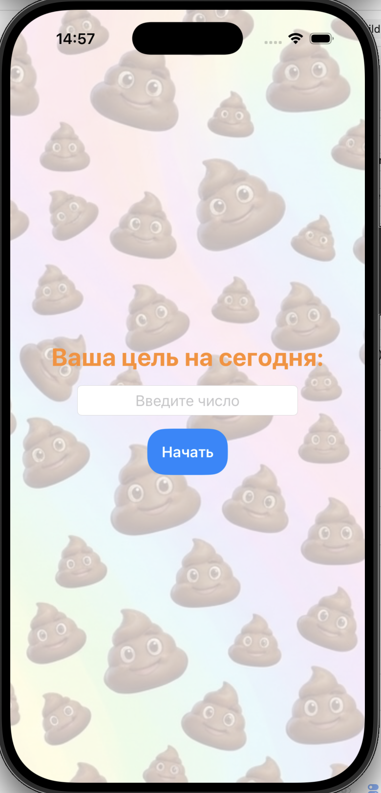
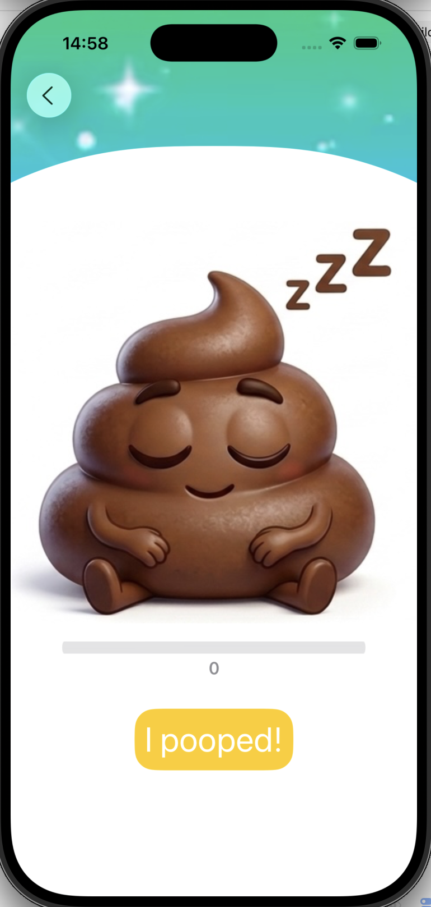
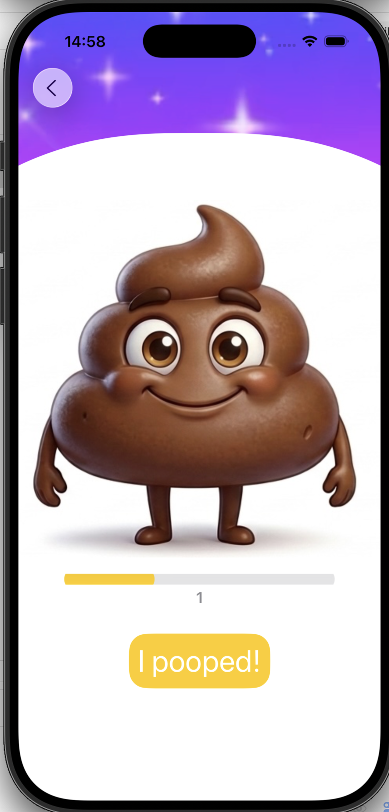
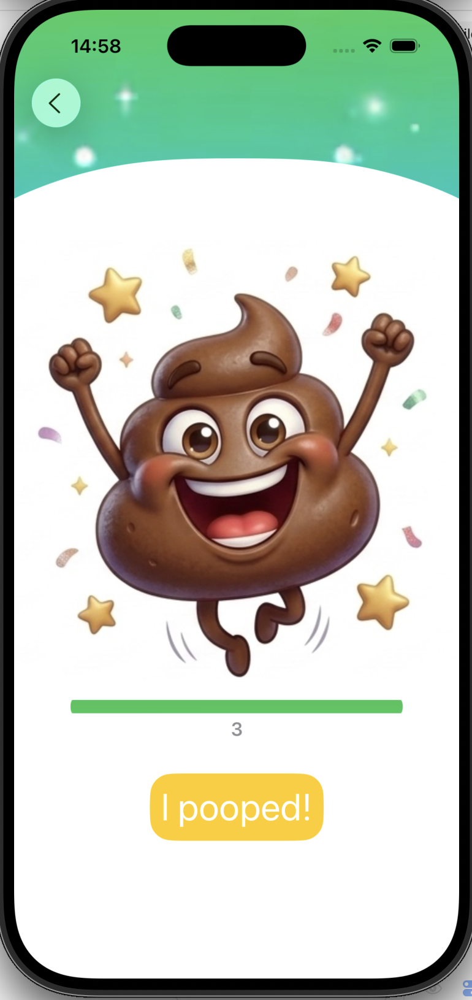

## Приложение для отслеживания посещений туалета

Приложение позволяет отслеживать количество посещений туалета в течение дня и сравнивать результат с заданной целью.

---

## Первый экран

При запуске приложения отображается стартовый экран:



В коде используется переменная:

```swift
@State private var dailyGoal: Int?
При запуске программы,нам отображается первое View:
```


Чтобы при вводе числа данные передавались на следующее View

## Второй экран
При нажатии на кнопку "Начать"
мы переходим на основной экран приложения:



В переменную goal передается мой желательный результат,
после чего я делаю проверку, которая от количества нажатий на кнопку "I pooped!" меняло изображение. 
``` swift
                switch k {
                case 0:
                    Image(.sleepy)
                        .resizable()
                        .scaledToFit()
                        .frame(width: 400, height: 400)
                case 1..<goal:
                    Image(.normal)
                        .resizable()
                        .scaledToFit()
                        .frame(width: 400, height: 400)
                case goal...:
                    Image(.happy)
                        .resizable()
                        .scaledToFit()
                        .frame(width: 400, height: 400)
                default:
                    Text("Error")
                }
```
Для отображения прогресса использовала прогресс-бар:
```swift
                    let currentProgress = min(Double(k) / Double(goal), 1.0)
                    
                    ProgressView(value: currentProgress)
                        .tint(k >= goal ? .green : .yellow)
                        .scaleEffect(x: 1, y: 3, anchor: .center)
                        .frame(width: 300)
```





## Video
В вёрстку экрана я добавила на задний план зациклинное видео для красивого визуала. 
Для работы с видео я использовала библиотеку import AVKit
```swift
            .onAppear {
                player.preventsDisplaySleepDuringVideoPlayback = true
                player.isMuted = true
                player.play()
```
я использую модификатор, который при создании видео выполняет мои требования, а именно воспроизводи видео без звука и не давай экрану погаснуть.
 
Зацикливание:
```swift
                NotificationCenter.default.addObserver(forName: .AVPlayerItemDidPlayToEndTime, object: player.currentItem, queue: .main) { _ in
                    player.seek(to: .zero)
                    player.play()
                }
```
Когда видео закончилось:
    1.    seek(to: .zero) → перемотка в начало
    2.    play() → снова запускаем

